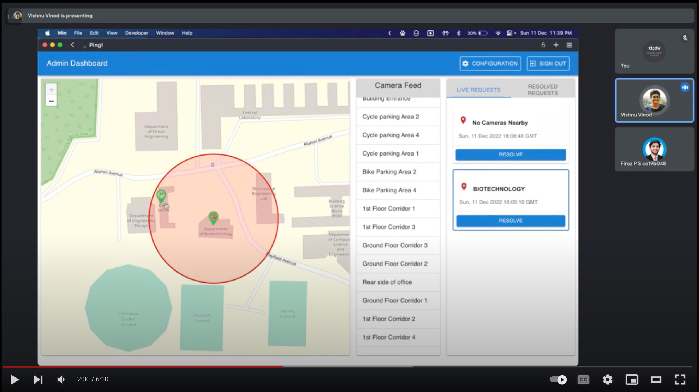
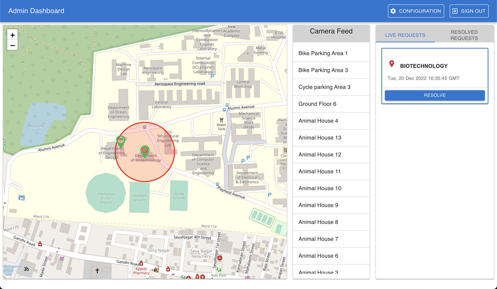
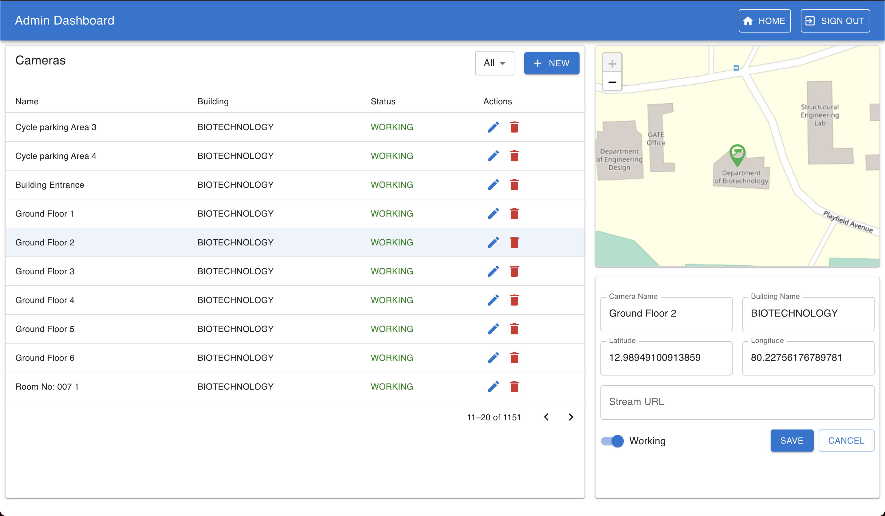
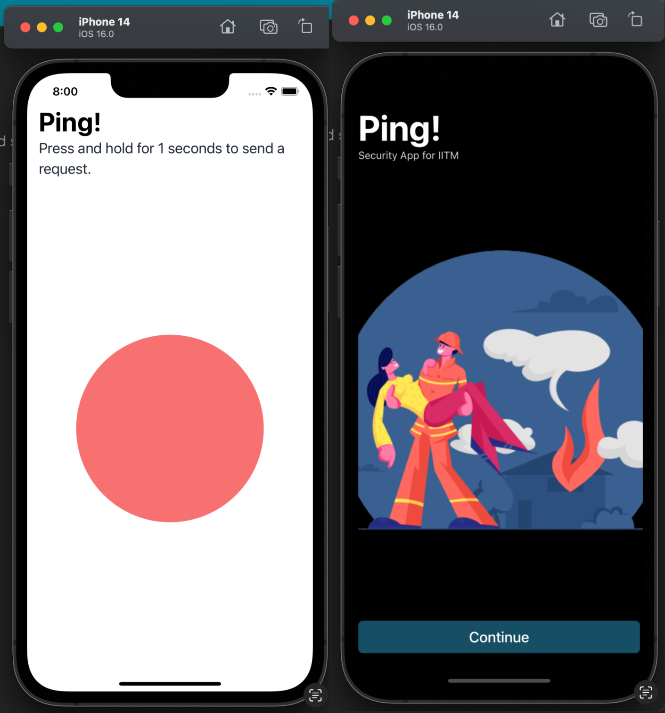

# Ping

- Developed an emergency-alert mobile app using React Native as part of a contest by the director.
- Built the Admin Dashboard using server sent events, showing accurate location of the user on a map, also showing all the nearest cameras with live camera-feed recording.

- Techstack used: Next JS, Express JS, MongoDB, Azure.

# 3 apps:

## Admin Dashboard app

## Mobile App

## Backend
